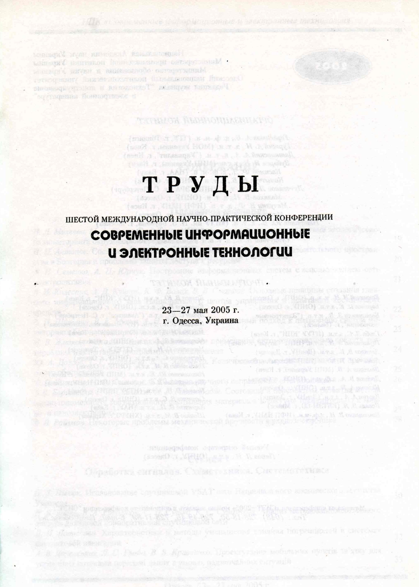
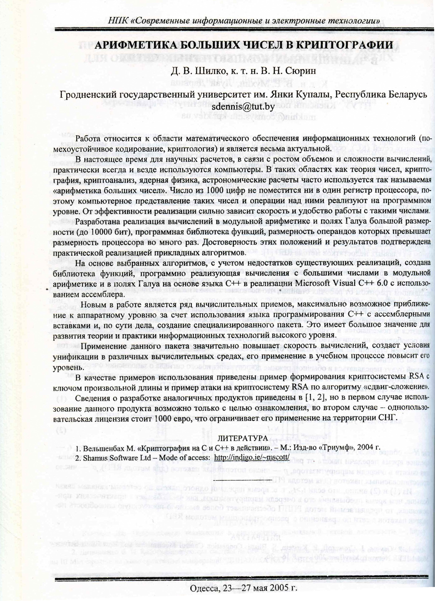
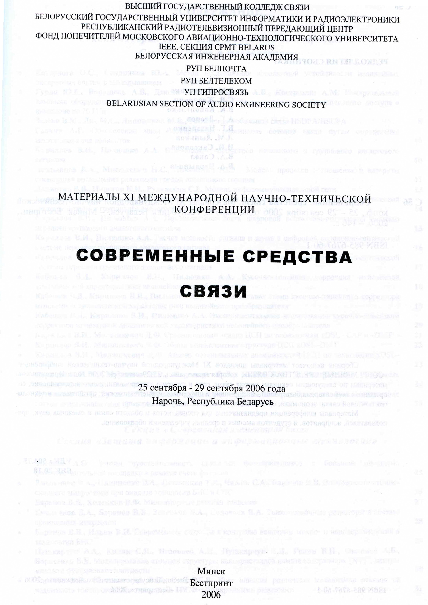
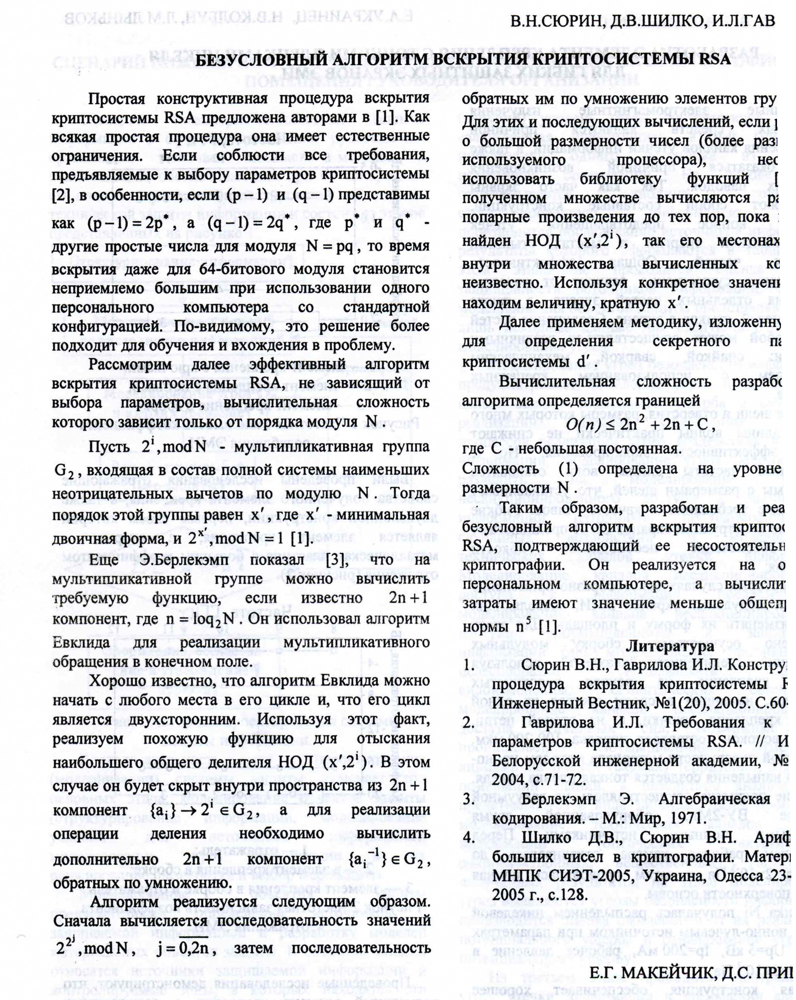

# undergrad_crypto

Tools for public cryptography RSA and DH in C++/x86 asm from my research and graduate work.

Written and tested on MS Visual C++ 6.
No external dependencies required.
Portable/posix version was never finished.

## XLong

Written around 2003.
Fast math routines for long integer.
Low level is implemented in x86 assembler (see *math_i386.cpp*).
Wrapped in C++ OOD interface.
Trivial RSA example included.

## XGaloisLib 

Written around 2004.
Fast math routines for galois fields GF 2^m math.

## Publications

